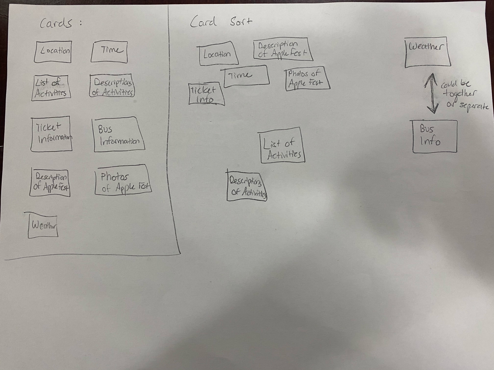
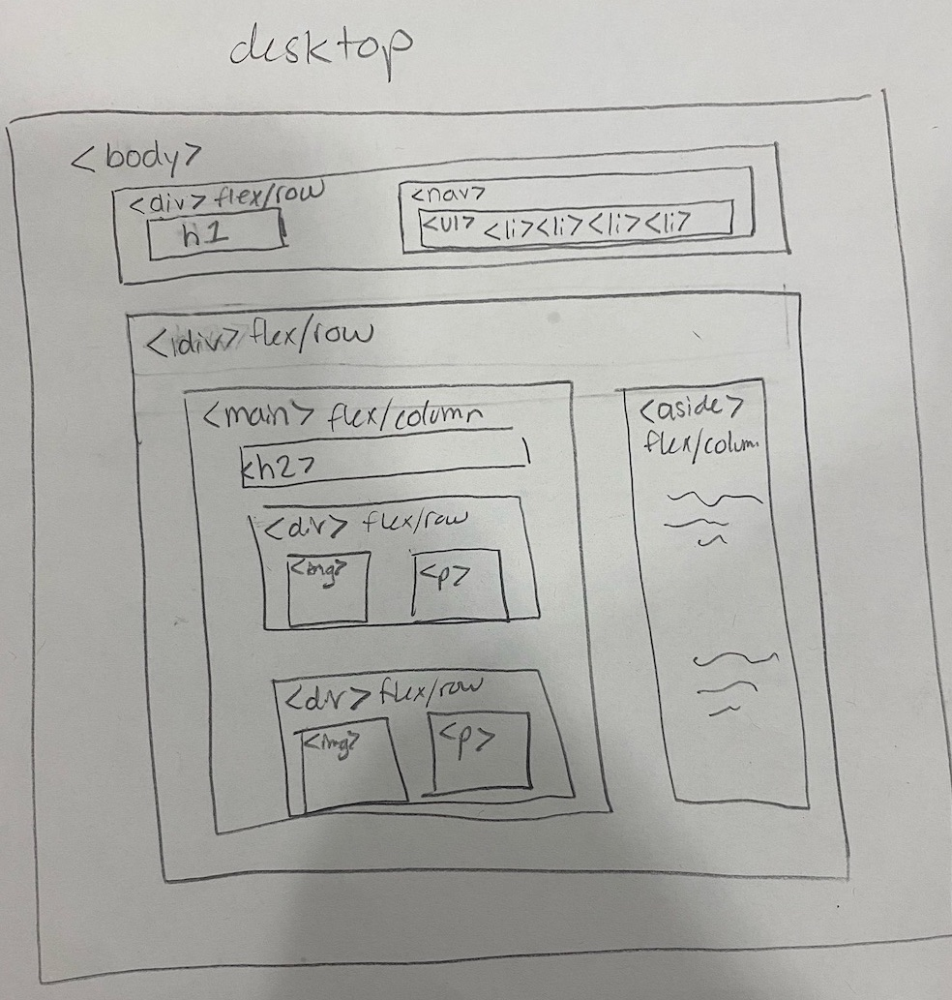
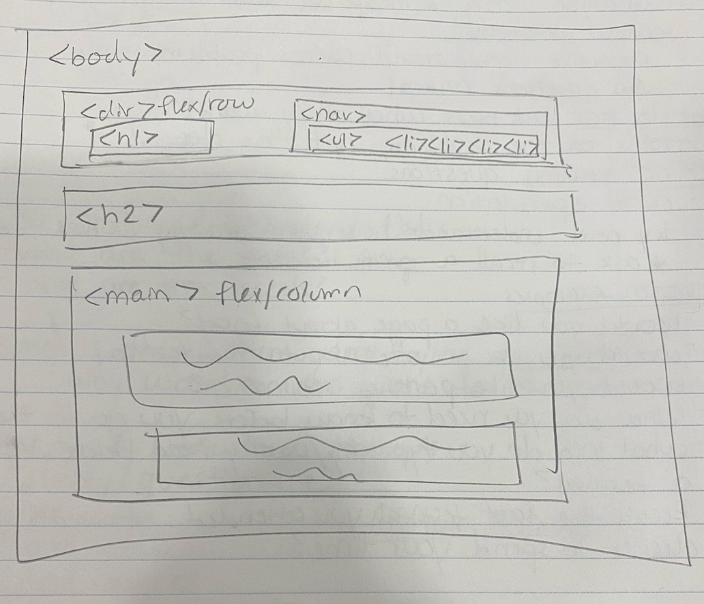
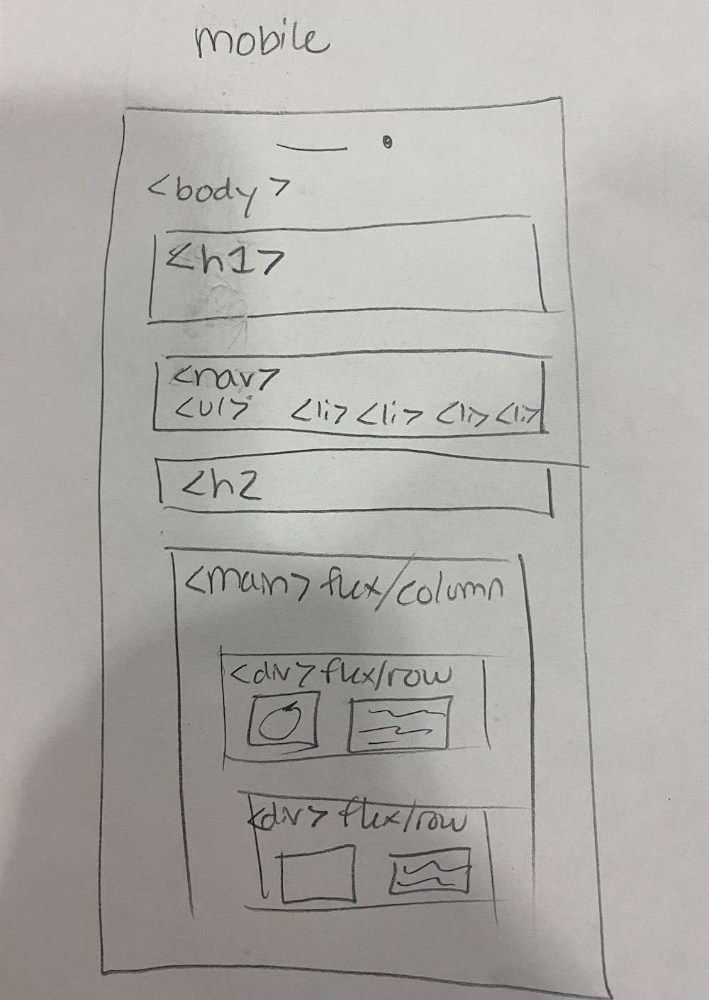
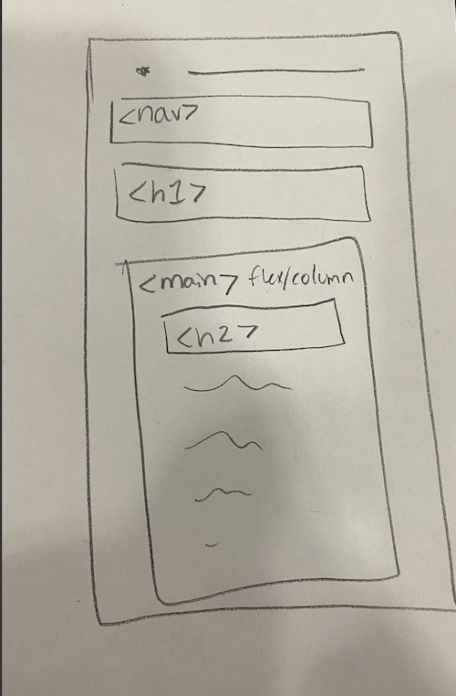
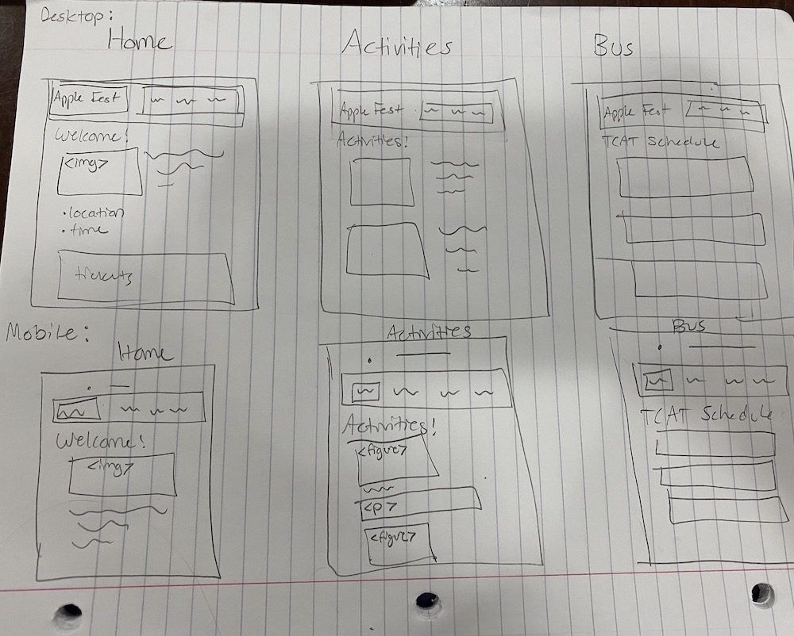

# Project 2: Design Journey

**For each milestone, complete only the sections that are labeled with that milestone.**

Be clear and concise in your writing. Bullets points are encouraged.

**Everything, including images, must be visible in Markdown Preview.** If it's not visible in Markdown Preview, then we won't grade it. We won't give you partial credit either. This is your warning.

## Design Planning

**Make the case for your decisions using concepts from class, as well as other design principles, theories, examples, and cases from outside of class.**

You can use bullet points and lists, or full paragraphs, or a combo, whichever is appropriate. The writing should be solid draft quality but doesn't have to be fancy.

### Audience (Milestone 1)
> Briefly explain who the intended audience(s) is for your website. Be specific and justify why this audience is appropriate for your site. Remember, you may not be the audience.

My intended audience is Cornell students who have a history of attending festivals. This audience is appropriate for my site because this type of person would likely attend the Ithaca Apple Fest, and would likely need to visit the website for planning purposes.

### Semi-Structured Interview Questions (Milestone 1)
> Plan your semi-structured interview which you'll use to identify the needs of your users. You are required to have a minimum of 4 questions.

1. Have you ever been to Ithaca Apple Festival?
  (If yes)
    What drove you to attend the festival?
  (If no) Can you remember the last festival you attended? What kinds of things drove you to attend the festival?
2. (If they answered no to the last question) What information did you need to attend this festival? How did you acquire such information?
  (If they answered yes to the last question) What information did you need to attend Ithaca Apple Fest? How did you acquire such information?
3. Is there anything that might prevent you from wanting to attend the Apple Festival? If so, why?
4. What sorts of features on a website make attending a festival as easy as possible, in your past experience? Can you expand on why?

### Interview Notes (Milestone 1)
> Interview at least 2 people from your audience. Take notes and include those notes here. Make sure to include a brief description of each interviewee.

Interviewee 1:

TODO: Interviewee 1 is a Sophomore at Cornell University who is interested in attending Apple Fest
TODO:

- she has been to ithaca apple fest. she wanted to do a fall activity, loves apples, and because everyone else was going.
- she needed to know when and where, and what is offered,
- most info was found from cornell student life instagram page, and from word of mouth.
- what would prevent her from going: bad weather, if there aren't very many activites, or if she's busy.
- features: everything on home page for more details, an easy browser to search for things, where to get tickets, what the dates are, the rules, any information like what she needs to attend

Interviewee 2:

TODO: Interviewee 2 is a Sophomore at Cornell who attended the Apple Fest last year.
TODO:
- She loves festivals, a lot of people rave about Apple Fest. she loves festivals bc wide range of activites to particpate in, quality time with friends.
- She needed to know where to buy tickets, where activites are located, how to get there, when and what time, and bus information. found info on the apple fest website
- as long as there weren't scheduling conflicts or if she couldnt figure out how to get there, she would not be prevented from going
- important info is explicitly stated and sticks out, presented in a precise and clear manner.

### Needs (Milestone 1)
> Analyze your audience's needs and wants from your notes above. List each need/want below. There is no specific number of needs required for this, but you need enough to do the job.

Need/Want 1: TODO: Location and time
- **Needs and Wants** _What does your client and audience need and want?_
  - My auidence needs to know the precise date, time, and location of the Ithaca Apple Fest
- **Design Ideas and Choices** _How will you meet those needs and wants?_
  - I will place the date, time, and location clearly on the homepage
- **Rationale & Additional Notes** _Justify your decisions; additional notes._
  - My audience expressed the need for emphasis on important items, so I will try to emphasize these elements
Need/Want 2: List of activities with descriptions and locations
- **Needs and Wants** _What does your client and audience need and want?_
  - Both of my interviewees expressed the need to know what is offered at the apple fest
- **Design Ideas and Choices** _How will you meet those needs and wants?_
  - I will make a list of the activities offered and information about them underneath each one. I may also include pictures
- **Rationale & Additional Notes** _Justify your decisions; additional notes._
  - There will probably be a link to this in the nav bar, and it will probably take up an entire page
Need/Want 3: Tickets
- **Needs and Wants** _What does your client and audience need and want?_
  - Both of my interviewees expressed the need to know how to obtain tickets
- **Design Ideas and Choices** _How will you meet those needs and wants?_
  - I will place the info about tickets on the homepage in a clear way, so that it is accessible to my audience.
- **Rationale & Additional Notes** _Justify your decisions; additional notes._
  - It is important that this is one of the first things my audience sees on the homepage.
Need/Want 4: Bus Information
- **Needs and Wants** _What does your client and audience need and want?_
  - One of my interviewees explained that not knowing how to get the the festival would prevent her from going, so I think a bus schedule is necessary for the website.
- **Design Ideas and Choices** _How will you meet those needs and wants?_
  - There will be a link to this page in the nav bar, and then I will place this information in a schedule-like manner, very clearly so that the audience cannot be confused by it.
- **Rationale & Additional Notes** _Justify your decisions; additional notes._
  - This page must get info from another source.
- Need/Want 5: Weather Information
- **Needs and Wants** _What does your client and audience need and want?_
  - One of my interviewees explained that bad weather would prevent herfrom going, so I think a bus schedule is necessary for the website.
- **Design Ideas and Choices** _How will you meet those needs and wants?_
  - There will be a link to this page in the nav bar, and then I will place this information an organized, list-like manner.
- **Rationale & Additional Notes** _Justify your decisions; additional notes._
  - This page must also get info from another source.

### Initial Design (Milestone 1)
> Document your design process. Show us your card sorting. Describe your theme. Show us sketches of your site (mobile and desktop versions). etc. You should show us how your came up with your design and how your iterated on that design; show us the evolution of your design.

My theme will be simple yet elegant, using sans-serif fonts for headers to give it a modern look and serif fonts for paragraphs to increase readability. The color theme will involve fall-like colors, so lots of reds, oranges, and browns, with a white background and black text for paragraphs. There would be a lot of whitespace so that the page does not feel too crowded.

Image of card sort process. I placed all of the content of my site into cards, and then sorted them based on what made the most sense. To me, that was sorting them into a homepage, information about activities, bus info, and weather. Bus information and weather could possibly be combined into one page, or I might decide to take out weather altogether, as it doesn't seem as relevent to the overall concept. These three pages will be linked on the homepage, which will welcome users to the site with a brief description and some pictures, as well as ticket info, times, and location. There will be links back to the homepage on each additional page.

For the first version of my desktop layout, I put a main and an aside within a div element.

For my second version of the desktop layout, I decided to simplify it and take away the aside, and removing the h2 element from inside the main.

For my first version of the mobile layout, I wanted to have everything in a column, so I avoided horizontal flex boxes for the most part, except for within the body.

For my second version of the mobile layout, I switched the nav bar and h1, and put the h2 inside the main, but the general concept is the same as the first version.

This is a sketch of what each page's layout should look like, on both mobile and desktop.

## Design

### Final Design (Milestone 2)
> Include the final sketches for each of your pages.

**Desktop Design:**
TODO

**Mobile Design:**
TODO

### Design Rationale (Milestone 2)
> Explain why your design is appropriate for your audience. Specially, why does your content organization, navigation, and site design/layout meet the needs of your users?

TODO

### Responsive Design Considerations (Milestone 2)
> Explain how you adapted your design to be responsive (support both mobile and desktop versions).

TODO

### Coded Draft Desktop Website (Milestone 2)
> Include screenshots of the draft version of your desktop design AND your mobile design. Include a screenshot for every page. If you're using Firefox, click the 3 dot button in the address bar and select "Take a Screenshot."

**Desktop Screenshots:**
TODO

**Mobile Screenshots:**
TODO

## User Testing (Round 1)

### User Testing Plan (Milestone 3)
> Plan out your user testing tasks before doing your user testing. These must be actual user testing tasks. **Tasks are not questions!**

1. TODO

2. TODO

3. TODO

### User 1 - Testing Notes (Milestone 3)
> When conducting user testing, you should take notes during the test. Place your notes here.

TODO

### User 1 (Milestone 3)
> Using your notes from above, describe your user by answering the questions below.

1. Who is your user, e.g., where does the user come from, what is the user's job, characteristics, etc.?

TODO

2. Does the user belong to your audience of the site? (Yes / No)
> If “No”, what’s your strategy of associating the user test results to your audience’s needs and wants? How can your re-design choices based on the user tests make a better fit for the audience?

TODO

### User 1 (Milestone 3)
> Report the results of your user's test. You should explain **what the user did**, describe the user's **reaction/feedback** to the design, **reflect on the user's performance**, determine what **re-design choices** you will make **for EACH task**. You can also add any additional comments. See the example design journey for an example of what this would look like.

Task: TODO: copy task here
- **Did you evaluate the desktop or mobile design?**
  - Pick one: desktop/mobile
- **How did the user do? Did they meet your expectation?**
  - TODO
- **User’s reaction / feedback to the design** (e.g., specific problems or issues found in the tasks)
  - TODO
- **Your reflections about the user’s performance to the task**
  - TODO
- **Re-design choices**
  - TODO
- **Additional Notes**
  - TODO: Justify your decisions; additional notes.

TODO...

### User 2 - Testing Notes (Milestone 3)
> When conducting user testing, you should take notes during the test. Place your notes here.

TODO

### User 2 (Milestone 3)
> Using your notes from above, describe your user by answering the questions below.

1. Who is your user, e.g., where does the user come from, what is the user's job, characteristics, etc.?

TODO

2. Does the user belong to your audience of the site? (Yes / No)
> If “No”, what’s your strategy of associating the user test results to your audience’s needs and wants? How can your re-design choices based on the user tests make a better fit for the audience?

TODO

### User 2 (Milestone 3)
> Report the results of your user's evaluation. You should explain **what the user did**, describe the user's **reaction/feedback** to the design, **reflect on the user's performance**, determine what **re-design choices** you will make **for EACH task**. You can also add any additional comments. See the example design journey for an example of what this would look like.

Task: TODO: copy task here
- **Did you evaluate the desktop or mobile design?**
  - Pick one: desktop/mobile
- **How did the user do? Did they meet your expectation?**
  - TODO
- **User’s reaction / feedback to the design** (e.g., specific problems or issues found in the tasks)
  - TODO
- **Your reflections about the user’s performance to the task**
  - TODO
- **Re-design choices**
  - TODO
- **Additional Notes**
  - TODO: Justify your decisions; additional notes.

TODO...

### Changes Based on User Testing (Milestone 3)
> What changes did you make to your design based on user testing?

TODO

## User Testing (Round 2)

### Finished Desktop & Mobile Website (Final Submission)
> Include screenshots of both the desktop and mobile version of your site that you will be using for user testing.

**Desktop Screenshots:**
TODO

**Mobile Screenshots:**
TODO

### User Testing Plan (Final Submission)
> Plan out your user testing tasks before doing your user testing. These must be actual user testing tasks. **Tasks are not questions!**
> These should be the same tasks from round 1.

1. TODO

2. TODO

3. TODO

### User 3 - Testing Notes (Final Submission)
> When conducting user testing, you should take notes during the test. Place your notes here.

TODO

### User 3 (Final Submission)
> Using your notes from above, describe your user by answering the questions below.

1. Who is your user, e.g., where does the user come from, what is the user's job, characteristics, etc.?

TODO

2. Does the user belong to your audience of the site? (Yes / No)
> If “No”, what’s your strategy of associating the user test results to your audience’s needs and wants? How can your re-design choices based on the user tests make a better fit for the audience?

TODO

### User 3 (Final Submission)
> Report the results of your user's test. You should explain **what the user did**, describe the user's **reaction/feedback** to the design, **reflect on the user's performance**, determine what **re-design choices** you will make **for EACH task**. You can also add any additional comments. See the example design journey for an example of what this would look like.

Task: TODO: copy task here
- **Did you evaluate the desktop or mobile design?**
  - Pick one: desktop/mobile
- **How did the user do? Did they meet your expectation?**
  - TODO
- **User’s reaction / feedback to the design** (e.g., specific problems or issues found in the tasks)
  - TODO
- **Your reflections about the user’s performance to the task**
  - TODO
- **Re-design choices**
  - TODO
- **Additional Notes**
  - TODO: Justify your decisions; additional notes.

TODO...

### User 4 - Testing Notes (Final Submission)
> When conducting user testing, you should take notes during the test. Place your notes here.

TODO

### User 4 (Final Submission)
> Using your notes from above, describe your user by answering the questions below.

1. Who is your user, e.g., where does the user come from, what is the user's job, characteristics, etc.?

TODO

2. Does the user belong to your audience of the site? (Yes / No)
> If “No”, what’s your strategy of associating the user test results to your audience’s needs and wants? How can your re-design choices based on the user tests make a better fit for the audience?

TODO

### User 4 (Final Submission)
> Report the results of your user's evaluation. You should explain **what the user did**, describe the user's **reaction/feedback** to the design, **reflect on the user's performance**, determine what **re-design choices** you will make **for EACH task**. You can also add any additional comments. See the example design journey for an example of what this would look like.

Task: TODO: copy task here
- **Did you evaluate the desktop or mobile design?**
  - Pick one: desktop/mobile
- **How did the user do? Did they meet your expectation?**
  - TODO
- **User’s reaction / feedback to the design** (e.g., specific problems or issues found in the tasks)
  - TODO
- **Your reflections about the user’s performance to the task**
  - TODO
- **Re-design choices**
  - TODO
- **Additional Notes**
  - TODO: Justify your decisions; additional notes.

TODO...

### Changes Based on User Testing (Final Submission
> What changes did you make to your design based on user testing?

TODO

## Self-Reflection (Final Submission)
> This was the first project in this class where you were able to follow a user-centered design process from start to finish. What did you learn from this experience?

TODO

> Take some time here to reflect on how much you've learned since you started this class. It's often easy to ignore our own progress. Take a moment and think about your accomplishments in this class. Hopefully you'll recognize that you've accomplished a lot and that you should be very proud of those accomplishments!

TODO
